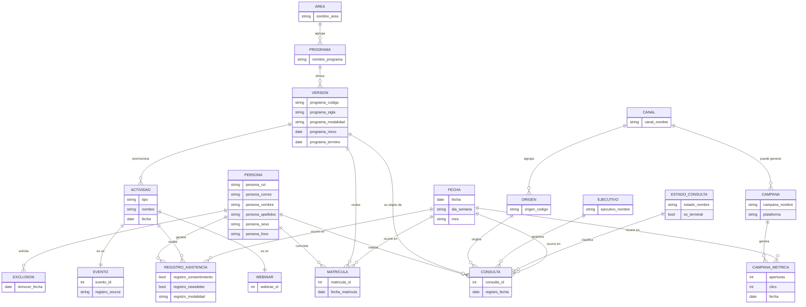

# Canonical Information Model — Marketing Operations System

Derived from the dashboard audit, the sanitized recovered notebook, and the Case 01 evidence atoms. Model only — no implementation. Where an entity or relationship is not directly visible in the dashboard but is required by the pipeline evidence, it's marked **(pipeline-only)**; where it's visible in the dashboard but not confirmed in the recovered code, it's marked **(dashboard-only, inferred)**.

## 1 · Entity-Relationship Diagram

Notes on this diagram:
- `ACTIVIDAD` is a generalization (ISA) of `WEBINAR` and `EVENTO` — a modeling choice forced by the recovered notebook itself, which literally `rbindlist()`s webinar and event registrations into one unified table (`df_cgin_todo`) before reporting on them. The dashboard doesn't show this layer at all; it's reconstructed purely from pipeline evidence.
- `CAMPANA` / `CAMPANA_METRICA` are **(pipeline-only)** — evidenced by Case 01 ("`04_campaign-and-dashboard.md`": GroupMail, GroupMail Insights, metrics parsing) but absent from this particular dashboard screen. The `CANAL → CAMPANA` link is drawn as "puede generar" (soft/plausible) rather than a firm FK, since no evidence confirms campaigns are tagged with the same `canal_nombre` taxonomy the dashboard uses.
- `EXCLUSION` is **(pipeline-only)**, but is the best available explanation for the negative "Rebold" count observed in the audit — drawn here as a hypothesis the model should be able to represent, not a confirmed join.
- `EJECUTIVO` is **(pipeline-only, latent)** — recovered as `consulta_ejecutivo` in the Fénix query, never modeled as its own dimension in the dashboard; the two leaked person-names in the "Formulario (origen)" column are the visible symptom of `EJECUTIVO` and `ORIGEN` being conflated in production.

## 2 · Star Schema

**Conformed dimension** — the one dimension every fact shares, and the entity the entire vertical-slice reconstruction is built around:

- **DIM_PERSONA** `(persona_key, persona_rut, persona_correo, persona_nombre, persona_apellidos, persona_sexo, persona_fono)`

Other dimensions:

- **DIM_FECHA** `(fecha_key, fecha, dia_semana, semana, mes, año)`
- **DIM_VERSION** `(version_key, programa_codigo, programa_sigla, programa_modalidad, fecha_inicio, fecha_termino, programa_key →)` — snowflakes to:
  - **DIM_PROGRAMA** `(programa_key, nombre_programa, area_key →)` — snowflakes to:
    - **DIM_AREA** `(area_key, nombre_area)`
  - *(A pure single-level star would denormalize `nombre_programa` and `nombre_area` directly onto `DIM_VERSION`; the dashboard's separate Área / Programa / Código tables suggest it queries this hierarchy at each level independently, which favors keeping the snowflake — or materializing three pre-aggregated summary tables, one per level, which is a common Looker Studio pattern.)*
- **DIM_ORIGEN** `(origen_key, origen_codigo, canal_key →)` — snowflakes to:
  - **DIM_CANAL** `(canal_key, canal_nombre)` — this is the dashboard's "llave_complex" bucket
- **DIM_EJECUTIVO** `(ejecutivo_key, ejecutivo_nombre)` — **(pipeline-only, not yet exposed in this dashboard)**
- **DIM_ESTADO_CONSULTA** `(estado_key, estado_nombre, es_terminal)`
- **DIM_ACTIVIDAD** `(actividad_key, tipo['webinar'|'evento'], nombre, fecha)` — **(pipeline-only)**
- **DIM_CAMPANA** `(campana_key, campana_nombre, plataforma)` — **(pipeline-only)**

Fact tables:

| Fact table | Grain | Dimension keys | Measures | Dashboard-evidenced? |
|---|---|---|---|---|
| **FACT_CONSULTA** | one row per prospect inquiry | fecha_key, persona_key, version_key, origen_key, ejecutivo_key, estado_key | `consulta_count` (always 1, additive) | Yes — funnel table, Leads KPI, all four ranked breakdowns |
| **FACT_MATRICULA** | one row per confirmed enrollment | fecha_key, persona_key, version_key | `matricula_count` (always 1) | Yes — the "Matrículas" line series, `Matriculado` funnel state |
| **FACT_REGISTRO_ASISTENCIA** | one row per person registered to one activity | fecha_key, persona_key, actividad_key | `registro_count`, `consentimiento_flag`, `newsletter_flag` | No — pipeline-only |
| **FACT_CAMPANA_METRICA** | one row per metric-day per campaign | fecha_key, campana_key | `aperturas`, `clics` | No — pipeline-only |
| **FACT_EXCLUSION** | one row per removal request | fecha_key, persona_key | `exclusion_count` | Possibly netted into `FACT_CONSULTA` channel rollups (hypothesis for the negative count) |

`Conversion %` is **not a fact** — it's a derived ratio computed at query time from `FACT_MATRICULA.matricula_count ÷ FACT_CONSULTA.consulta_count` over the same filtered slice (dimension mismatch between the two facts is exactly why the scorecard didn't reconcile cleanly in the audit).

## 3 · Canonical Glossary

| Canonical term | Recovered / dashboard label(s) | Definition | Provenance |
|---|---|---|---|
| **Persona** | `persona_*` fields | A unique individual who has interacted with the organization through any channel — the conformed identity across every fact. | Pipeline + dashboard (implicit, aggregated) |
| **Consulta** | "Leads", funnel bars, `pros_prospecto` | A single inquiry/prospect record: one person expressing interest in one program version at one point in time. | Both |
| **Estado de consulta** | Interesado / Desechado / Gestionado / Matriculado / Retracto Matrícula / Evaluado / Matrícula en Proceso / Reservar Matrícula | The current lifecycle status of a `Consulta`. A controlled state set, not a strict linear funnel — includes terminal (Desechado, Matriculado) and reversible (Retracto Matrícula) states. | Dashboard (values); pipeline (underlying `pros_estado` join) |
| **Matrícula** | "Matrículas" line, `viaje_viajes` | A confirmed enrollment event: a `Persona` formally enrolling in a `Versión` of a `Programa`. | Both |
| **Área** | "Área" table | The broadest academic classification (7 values observed: Control de Gestión, Sistemas y TI, Contabilidad y Auditoría, Business Analytics, Tributación, Gestión de Operaciones y Procesos, Gestión en Educación). | Dashboard; field recovered as `programa_area` |
| **Programa** | "Programa" table, `prg_programa` | A named course/diploma (78 values observed), independent of cohort or campus. | Both |
| **Versión / Código** | "Código" table, `codigo_trazabilidad`, `ver_versiones` | A specific offering instance of a `Programa` — one cohort/campus/modality run (139 values observed, ~1.8 per program). | Both |
| **Sigla** | (not shown directly on screen) | The program-family prefix derived from `programa_codigo` by taking the substring before its first digit pair (e.g. `DIGO25CL2AV` → `DIGO`). Recovered verbatim as `sigla_from_codigo`. Plausibly the join key that rolls 139 codes up to 78 programs. | Pipeline (confirmed function); dashboard (inferred use) |
| **Canal** | "llave_complex" bar chart | A coarse, derived grouping of lead source into 6 buckets: IProspect, Convierta, Admision, UE (int), UE (web), Rebold. Explicitly labeled a *complex/composite key* — not a raw column. | Dashboard-only, inferred derivation |
| **Formulario / Origen** | "Formulario (origen)" table, `consulta_origen` | The granular, form/tracking-tag-level source of a `Consulta` (51 values observed: `ip_fb`, `convierta_google`, `convierta_meta`, `Contacto Web`, etc.). Two observed values are person names — a data-quality defect, not a valid channel tag. | Both |
| **Ejecutivo** | `consulta_ejecutivo` | The staff member who owns or logged a `Consulta`. Recovered in the Fénix query but not modeled as its own dimension in the dashboard — its absence is the likely cause of names leaking into `Origen`. | Pipeline-only |
| **Actividad** | (not shown) | Generalization of `Webinar` and `Evento` — anything a `Persona` can register attendance to. Modeled because the recovered CGIN report unions both into one table before analysis. | Pipeline-only |
| **Webinar** | `df_webinar`, webinar CSV exports | An online session tied to a `Versión`, identified by a numeric id recovered from its export filename. | Pipeline-only |
| **Evento** | `df_eventos_ue` / `df_eventos_dcs` | An in-person or hybrid event, tagged by originating organizational unit (`registro_source`: UE or DCS). | Pipeline-only |
| **Exclusión / Remover** | `contacto_remover` | A person's request to be excluded from marketing communications. Hypothesized as the mechanism behind the dashboard's negative channel count, not confirmed. | Pipeline-only |
| **Campaña** | GroupMail | A dispatched email campaign, tracked via GroupMail Insights for opens/clicks. Not present in this dashboard screen at all. | Pipeline-only (Case 01 evidence, not the notebook) |
| **Leads** | scorecard | The dashboard's label for the count of `Consulta` rows in the filtered period. | Dashboard |
| **Conversion** | scorecard | A derived ratio, not a stored fact — see star schema note above on why it didn't reconcile exactly in the audit. | Dashboard |
